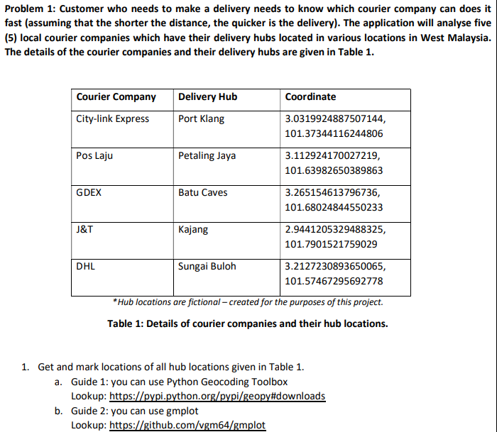

# Algorithm-Analysis-and-Design-Project

One of the essences of computer science and information technology is to solve problems faced by
humankind. As the outcome of this project, you are required to develop a computer program that is able to
resolve the following problems:-

Problem 1: Customer who needs to make a delivery needs to know which courier company can does it
fast (assuming that the shorter the distance, the quicker is the delivery). The application will analyse five
(5) local courier companies which have their delivery hubs located in various locations in West Malaysia.
The details of the courier companies and their delivery hubs are given in Table 1.

