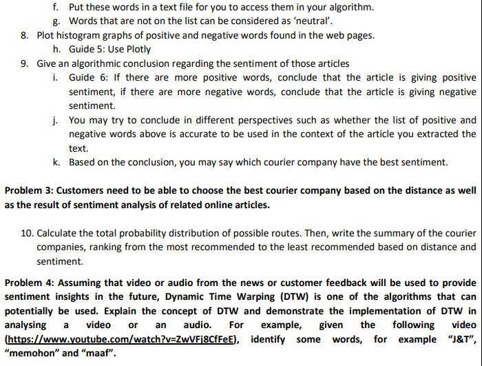

# Algorithm-Analysis-and-Design-Project

One of the essences of computer science and information technology is to solve problems faced by
humankind. As the outcome of this project, you are required to develop a computer program that is able to
resolve the following problems:-

